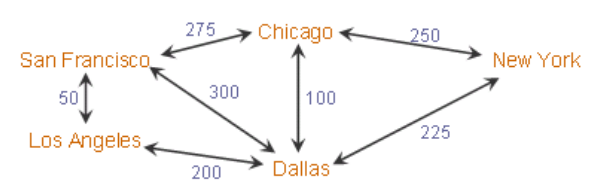

# Breadth-first search (ORACLE)

Search algorithm for finding the shortest route. To create dataset run [data.sql](data.sql).



# Implementation

```sql
WITH trips (dest, path, total_cost) AS
         ((SELECT dest,
                  "start" || ',' || dest,
                  cost
           FROM flights
           WHERE "start" = $start)
          UNION ALL
          (SELECT f.dest,
                  t.path || ',' || f.dest,
                  t.total_cost + f.cost
           FROM trips t,
                flights f
           WHERE t.dest = f."start"
             AND instr(t.path, f.dest) = 0
             AND f."start" <> $end))
SELECT path, total_cost
FROM trips
WHERE dest = $end
ORDER BY total_cost;
```

Result

| Path             | Total cost |
|------------------|------------|
| "SF,LA,DA,NY"    | 475        |
| "SF,CH,NY"       | 525        |
| "SF,DA,NY"       | 525        |
| "SF,LA,DA,CH,NY" | 600        |
| "SF,CH,DA,NY"    | 600        |
| "SF,DA,CH,NY"    | 650        |
